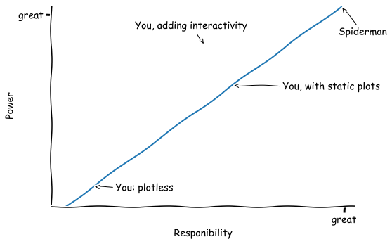

## Why plot?
The goal of research is to improve our understanding of the world, but that increase in knowledge is small if that understanding doesn't spread.  

Humans benefit from visual representation of data to see patterns and plotting data has become an essential part of the researcher's toolbox for communication.

> ## Our reliance on the visual?
> When was the last time you saw a research paper without figures?
> When reading research do you start with the figures?
> How would the recent publications you have studied have made sense if you couldn't see the figures?
{: .discussion}

## Choices in analysis and presentation
Producing a figure will often decide on the story you want to tell, or the pattern you wish to highlight in your data. You have to decide which variables in your data (group, treatment, location, time, amount)to map to the available visual dimensions (x-y-z position / colour / symbols / etc).

Modern sources of data often present aditional problems, those of density and complexity, that require further choices relating to aggregation and ommission. All of these aspects require choices and this can force a certain interpretation on your audience, a limit what you can show.

Interactivity gives the reader/user a chance to explore the data in ways a static (non-interactive) plot does not.  It can also help you and your collaborators understand your data better.

> ## A wealth of choices for making figures in Python
> This tutorial makes us of Plotly and Streamlit, but a range of options now exist for visualizing data in the Python ecosystem.  These are summariazed at [PyViz.org](https://pyviz.org/tools.html).
> Many of the tools described are developed with specific use cases in mind, whereas others are intentionally more basic and adaptable. Some are focused on particular issues, such as choices of colour or aggregation of data. There is a lot here to explore...
{: .callout}

### The steps for constructing our interactive data visualization

    - Building your environment for analysis and plotting (in a way that can be repeated)
    - Data processing and cleaning. 
    - Separating out variables of interest.
    - Identifying variables you may want to explore (and how best to map these to visual differences/dimensions).
    - Visualizing the central data (choosing your plot types)
    - Converting addtional choices in the visualization to widgets.
    - Hosting a plot as an app (so it can be seen ad explored)


