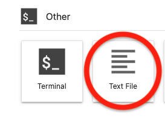
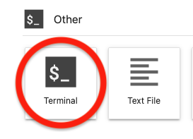

Now that our data and visualizations are prepped, it's finally time to create our Streamlit app.

## Creating and starting the app

While you usually want to create Jupyter Notebooks in Jupyter Lab, you can also create other file types and have a terminal. We are going to use both of these capabilities.

From the Launcher, click on "Text File" under "Other" (make sure you are currently in your project root directory, and not the `data` folder). This will open a new file. 

By default, this will be a text file, but you can change this. Go ahead and save this empty file as `app.py` ("File" > "Save Text As..." > "app.py"). Then we can add some import statements, and save the file again.

~~~
import streamlit as st
import pandas as pd
import plotly.express as px
~~~
{: .language-python}

Next, go back to the Launcher and click on "Terminal" under "Other". This will launch a terminal window within Jupyter Lab. 

If you type `pwd` and enter, you will see that you are currently in your project root. 

~~~
pwd
~~~
{: .language-bash}

~~~
/Users/<you>/Desktop/data_viz_workshop
~~~
{: .output}

If you type `ls` and enter, you will see all of your files and directories. 

~~~
ls
~~~
{: .language-bash}

~~~
Data                      app.py                    data_visualizations.ipynb data_wrangling.ipynb      environment.yml
~~~
{: .output}

Make sure that you see `app.py`. We can also see what environment we are currently in with `conda env list`. There should be a * next to `dataviz`. 

~~~
conda env list
~~~
{: .language-bash}

~~~
# conda environments:
#
base                     /opt/anaconda3
dataviz               *  /opt/anaconda3/envs/dataviz
~~~
{: .output}

If not, go ahead and type `conda activate dataviz`. 

~~~
conda activate dataviz
~~~
{: .language-bash}

Now that we know we are in the right place and have the right environment (the one with streamlit installed), we are going to start the Streamlit app.

~~~
streamlit run app.py
~~~
{: .language-bash}

This will launch our app in a new tab. Right now, the app is empty. So let's add some content!

## Add a title to the app

Go back to the tab in Jupyter Lab for our `app.py` file. We have some import statements, but no content. Let's start with a title:

~~~
st.title("Interact with Gapminder Data")
~~~
{: .language-python}

You can make this title whatever you want. Save the file, and go back to the brower tab with our Streamlit app. Notice the prompt in the upper right corner? Go ahead and click on "Rerun". Now we can see our title!

We can add other text to our app with `st.write()` and other functions.

> ## Check out the documentation
>
> Whenever you are working with a new library - or even one that you are familiar with! - it's a good idea to look through the documentation.
> You can find Streamlit's documentation [here](https://docs.streamlit.io/library/api-reference)
{: .callout}

## Add a plot to the app

Now, let's go ahead and add the visualization of GDP in Oceania that we created in the previous lesson. We can copy and paste the code over from our Jupyter Notebook - but leave out the `fig.show()`. We're going to use a different function to display the plot in the Streamlit app: `st.plotly_chart()`

~~~
df = pd.read_csv("Data/gapminder_tidy.csv")
df_gdp_o = df.query("continent=='Oceania' & metric=='gdpPercap'")

title = "GDP for countries in Oceania"
fig = px.line(df_gdp_o, x = "year", y = "value", color = "country", title = title, labels={"value": "GDP Percap"})
st.plotly_chart(fig)
~~~
{: .language-python}

Save `app.py`, switch over to the Streamlit app, and click "Rerun". Now we can see our Oceania GDP line chart!

Right now, this line chart is a bit squashed and small, so we're going to change some settings so the plot will take up more space. 
First, at the beginning of the app we'll add the line: `st.set_page_config(layout="wide")`.
Next, we'll add an argument to our display function: `st.plotly_chart(fig, use_container_width=True)`

Our whole app script now looks like:

~~~
import streamlit as st
import pandas as pd
import plotly.express as px

st.set_page_config(layout="wide")
st.title("Interact with Gapminder Data")

df = pd.read_csv("Data/gapminder_tidy.csv")
df_gdp_o = df.query("continent=='Oceania' & metric=='gdpPercap'")

title = "GDP for countries in Oceania"
fig = px.line(df_gdp_o, x = "year", y = "value", color = "country", title = title, labels={"value": "GDP Percap"})
st.plotly_chart(fig, use_container_width=True)
~~~
{: .language-python}

You know the drill! Save, switch over to the Streamlit app, and click "Rerun".

We now have a web application that can allow you to share your interactive visualizations.

## Exercises

> ## Add a description
>
> After the plot is displayed, add some text describing the plot.
> > ## Solution
> > ~~~
> > st.plotly_chart(fig, use_container_width=True) # this line is already in the app
> > st.markdown("This plot shows the GDP Per Capita for countries in Oceania.")
> > ~~~
> > {: .language-python}
> {: .solution}
{: .challenge}

> ## Show me the data!
>
> After the plot is displayed, also display the dataframe used to generate the plot.
> > ## Solution
> > ~~~
> > st.dataframe(df_gdp_o) # df_gdp_o is defined in the code created in this lesson
> > ~~~
> > {: .language-python}
> {: .solution}
{: .challenge}



