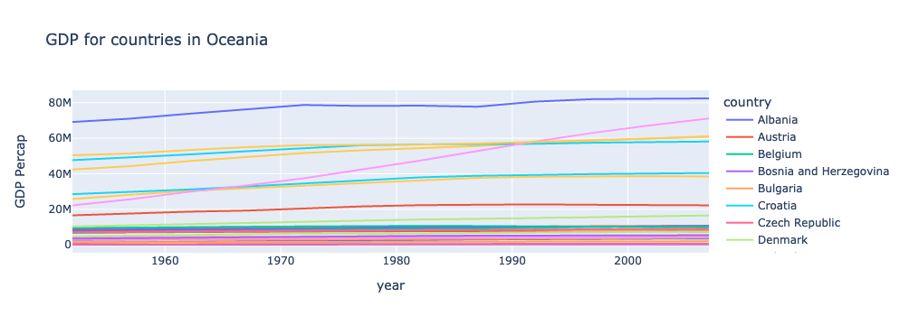
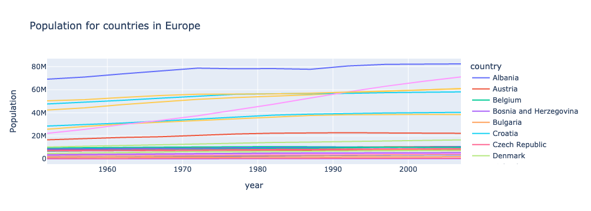
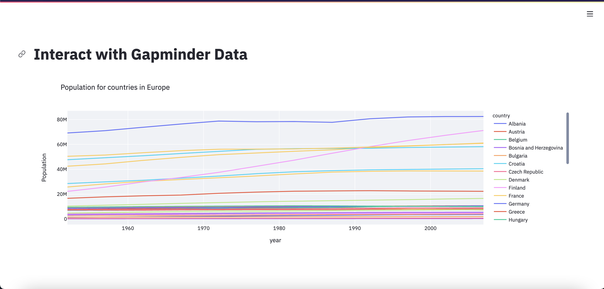

We now have a working Streamlit app. However, it is only displaying one plot, and we can't currently change what that plot is showing. 
And we know that there is a lot more information to visualize in our dataset!
So we are going to add in even more interactivity with some widgets. 
However, before we can add in widgets, we need to refactor our code. Widgets are an interface for users to set a variable to some value. Our code needs to be refactored to use variables instead of "hard-coded" values. 

For now, we will set these variables (`continent` and `metric` in the code below) to be strings. That means that after refactoring, the app will not actually look any different. However, it will make adding the widgets in much easier - because we will assign those `continent` and `metric` variables to the widget output.

The `app.py` file is not a great place to experiment and iterate with our code. For that, let's go back to our `data_visualizations.
ipynb` Jupyter notebook.

We can add a markdown cell at the bottom of the notebook, and give this section a subtitle:

~~~
## Prep for widgets
~~~
{: .source}

## f-Strings for variables within strings

First, let's decide what attributes we want to be able to change in the plot. Right now, the plot is showing the GDP for countries in Oceania - that right there is two different attributes: the metric (GDP) and the continent (Oceania).

These are also the two attributes that we are filtering for using `df.query()`:

~~~
df_gdp_o = df.query("continent=='Oceania' & metric=='gdpPercap'")
~~~
{: .language-python}

Notice that what is passed to `df.query()` is simply a string. Right now, the specific values of "Oceania" and "gdpPercap" are specified in the string. However, we can easily make these values variable using f-Strings.

> ## learn more about f-Strings
> f-Strings are the modern way of formatting strings in Python. 
> You may have used the "old-school" methods of %-formatting or `str.format()` to accomplish the same goal, but the syntax for f-Strings is much nicer. 
> You can learn more about f-Strings [here](https://realpython.com/python-f-strings/).
{: .callout}

To incorporate f-Strings into our query, let's tweak a few things. Try out this code in a cell in your Jupyter Notebook.

~~~
continent = "Oceania"
metric = "gdpPercap"

old_query = "continent=='Oceania' & metric=='gdpPercap'"
new_query = f"continent=='{continent}' & metric=='{metric}'"

print(old_query)
print(new_query)
~~~
{: .language-python}

~~~
continent=='Oceania' & metric=='gdpPercap'
continent=='Oceania' & metric=='gdpPercap'
~~~
{: .output}

Notice how the two strings are identical?

The `new_query` variable is more flexible, because we can redefine the `continent` and `metric` variables. Go ahead and try it!

~~~
continent = "Europe"
metric = "pop"

query = f"continent=='{continent}' & metric=='{metric}'"

print(query)
~~~
{: .language-python}

~~~
continent=='Europe' & metric=='pop'
~~~
{: .output}

It's important to isolate these `continent` and `metric` values because we can adjust them with our widgets.

Let's go ahead and try incorporating this into our plot (still in the Jupyter Notebook)

~~~
continent = "Europe"
metric = "pop"

query = f"continent=='{continent}' & metric=='{metric}'"
df_filtered = df.query(query)

title = "GDP for countries in Oceania"
fig = px.line(df_filtered, x = "year", y = "value", color = "country", title = title, labels={"value": "GDP Percap"})
fig.show()
~~~
{: .language-python}

Something about this plot is funky... do you notice any other places where we need to incorporate f-Strings? 

The title and axis lables!

~~~
continent = "Europe"
metric = "pop"

title = f"{metric} for countries in {continent}"
labels = {"value": f"{metric}"}

print(title)
print(labels["value"])
~~~
{: .language-python}

~~~
pop for countries in Europe
pop
~~~
{: .output}

Let's show that plot again, with our updated code:

~~~
continent = "Europe"
metric = "pop"

query = f"continent=='{continent}' & metric=='{metric}'"
df_filtered = df.query(query)

title = f"{metric} for countries in {continent}"
fig = px.line(df_filtered, x = "year", y = "value", color = "country", title = title, labels={"value": f"{metric}"})
fig.show()
~~~
{: .language-python}

There's just one more thing to tweak. "gdpPercap", "lifeExp", and "pop" aren't the prettiest labels. Let's map them to more display-friendly labels with a dictionary. Then we can call on this dictionary within our f-strings:

~~~
metric_labels = {"gdpPercap": "GDP Per Capita", "lifeExp": "Average Life Expectancy", "pop": "Population"}
~~~
{: .language-python}

Now, here's our final code:

~~~
continent = "Europe"
metric = "pop"

query = f"continent=='{continent}' & metric=='{metric}'"
df_filtered = df.query(query)

metric_labels = {"gdpPercap": "GDP Per Capita", "lifeExp": "Average Life Expectancy", "pop": "Population"}

title = f"{metric_labels[metric]} for countries in {continent}"
fig = px.line(df_filtered, x = "year", y = "value", color = "country", title = title, labels={"value": f"{metric_labels[metric]}"})
fig.show()
~~~
{: .language-python}

## Getting lists of possible values

There is one last step before we can be ready to create our widgets. We need a list of all continents and all metrics, so that users can select from valid options. To do this, we will use pandas' `unique()` function.

~~~
df['continent'].unique()
~~~
{: .language-python}

~~~
array(['Africa', 'Americas', 'Asia', 'Europe', 'Oceania'], dtype=object)
~~~
{: .output}

See how we get every possible value in the `continents` column exactly once? Let's define this as a list, assign it to a variable, and do the same thing for `metric`.

~~~
continent_list = list(df['continent'].unique())
metric_list = list(df['metric'].unique())

print(continent_list)
print(metric_list)
~~~
{: .language-python}

~~~
['Africa', 'Americas', 'Asia', 'Europe', 'Oceania']
['gdpPercap', 'lifeExp', 'pop']
~~~
{: .output}

These lists will be used when defining our widgets.

## Update app.py with our refactored code

Now, we are ready to define our widgets. Let's copy this final code over to our `app.py` file, so that it is like this:

~~~
import streamlit as st
import pandas as pd
import plotly.express as px

st.set_page_config(layout="wide")
st.title("Interact with Gapminder Data")

df = pd.read_csv("Data/gapminder_tidy.csv")

continent_list = list(df['continent'].unique())
metric_list = list(df['metric'].unique())

continent = "Europe"
metric = "pop"

query = f"continent=='{continent}' & metric=='{metric}'"
df_filtered = df.query(query)

metric_labels = {"gdpPercap": "GDP Per Capita", "lifeExp": "Average Life Expectancy", "pop": "Population"}

title = f"{metric_labels[metric]} for countries in {continent}"
fig = px.line(df_filtered, x = "year", y = "value", color = "country", title = title, labels={"value": f"{metric_labels[metric]}"})
st.plotly_chart(fig, use_container_width=True)
~~~
{: .language-python}



